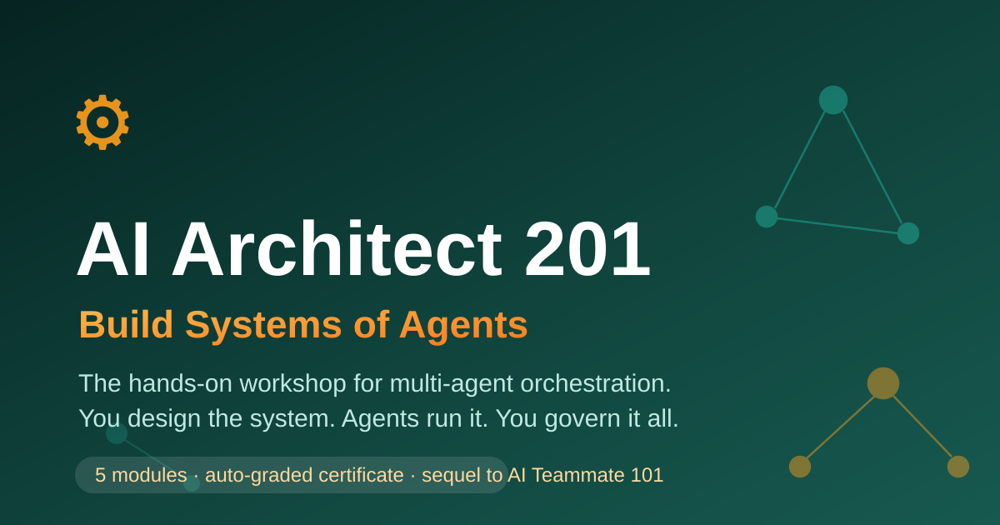

# AI Architect 201
### Build Systems of Agents

  

**In Course 1 you learned to work _with_ an agent. Now you learn to design systems _of_ agents.**

A self-paced, hands-on workshop on **multi-agent orchestration** — MCP servers, agent-to-agent
hand-offs, trust boundaries, governance policies, and observability. The skills that turn a
tech lead into an **AI systems architect**.

 

### Start in 60 seconds

**[Use this template](../../generate) — name it `my-ai-architect-workshop` — make it public — open Module 00**

~3 hours &nbsp;|&nbsp; Auto-graded certificate &nbsp;|&nbsp; 100% on GitHub.com — nothing to install

 

<a href="#the-system-youll-build">The System</a> &nbsp;·&nbsp;
<a href="#what-youll-walk-away-with">Outcomes</a> &nbsp;·&nbsp;
<a href="#module-map">Modules</a> &nbsp;·&nbsp;
<a href="#how-to-take-this-workshop">How It Works</a> &nbsp;·&nbsp;
<a href="#prerequisites">Prerequisites</a> &nbsp;·&nbsp;
<a href="#faq">FAQ</a>

---

## The system you'll build

  

<b>Design &rarr; Dispatch &rarr; Orchestrate &rarr; Govern &rarr; Ship.</b> One agent was a teammate. A system of agents is architecture.

---

## What you'll walk away with

| | |
|---|---|
| **MCP fluency** | Connect agents to external tools through Model Context Protocol servers — and know exactly what you're trusting when you do |
| **Orchestration patterns** | Design multi-agent workflows with clear hand-off points, parallel dispatch, and failure isolation |
| **Governance instincts** | Write policies that scope what each agent can read, write, and execute — least privilege for AI |
| **Debugging superpowers** | Trace a failed pipeline through multi-agent session logs and pinpoint which stage broke |
| **A certificate** | Hit 6/6 milestones and the examiner bot awards a shareable **Certified AI Architect** certificate — right inside your own repo |

---

## What makes this workshop different

Most multi-agent content is theory and diagrams. This one puts you in the **architect's chair**:

- **Auto-graded.** A built-in examiner bot watches your repo and checks off milestones as you connect, dispatch, govern, and ship.
- **Real orchestration decisions.** PipelineForge forces genuine trade-offs — which stage gets which permissions, where hand-offs can fail, what gets logged.
- **Builds on muscle memory.** Every exercise reuses the issue → agent → PR → review loop you mastered in Course 1 — then scales it across a team of agents.

<b>Why this workshop exists</b> — the 30-second version

 

Delegating one task to one agent was step one. The next shift in AI-assisted development is **systems of agents** — pipelines where specialist agents hand work to each other, constrained by governance policies and watched by observability tooling. Someone has to design those systems, decide what each agent is allowed to touch, and debug them when they fail.

That's an architect's skill. This workshop gives it to you in ~3 hours, using nothing but your own GitHub account and your own Copilot license.

<b>What you'll build</b> — meet PipelineForge

 

You'll copy this template, then spend the workshop as the architect of **PipelineForge** — a lightweight content automation pipeline. It takes a GitHub issue as input and routes it through a chain of specialist agents: **research → draft → review → publish**. Simple enough to understand in one sitting. Complex enough to require real orchestration decisions: scoped permissions per stage, hand-off contracts, failure tracing, and a governance policy you'll write yourself.

---

## How to take this workshop

> **Skim first, click second.** Here's the whole flow before you touch anything:

1. **Use this template &rarr; Create a new repository** (button at the top of this page).

<b>📹 Walkthrough: Use This Template</b>

 

2. Name it **`my-ai-architect-workshop`**.
3. For **Description**, copy-paste:
   > _My AI Architect 201 workshop — hands-on practice orchestrating multi-agent pipelines with MCP servers, governance policies, and observability, on my way to the Certified AI Architect certificate._
4. Make it **public** — Actions minutes are free on public repos, and the progress bot needs them.
5. Hit the green **Create repository** button.
6. **Turn your copy into a website** (60 seconds): go to **Settings &rarr; Pages &rarr; Deploy from a branch &rarr; `main` / `(root)` &rarr; Save**. Then open `https://<your-username>.github.io/my-ai-architect-workshop/` — this is how you'll read the workshop.

<b>📹 Walkthrough: Pages to Publish</b>

 

7. Open **[Module 00](setup/00-environment.md)**. Work through the modules in order. Each ends with a **checkpoint**, and the **progress bot** tracks your milestones automatically in your copy's Issues.
8. Everything happens in _your copy_ of this repo. Break things freely — that's the point.
9. Finish all 6 milestones → **certificate unlocked**. Merge the certificate PR and you're done.

<b>Prefer a browser-based setup?</b> Open it in GitHub Codespaces instead

 

---

## Module map

| # | Module | Time | You'll learn to… |
|---|--------|------|------------------|
| 00 | [Environment setup](setup/00-environment.md) | 15 min | Get your repo, license, and tooling ready |
| 01 | [MCP Foundations](modules/01-mcp-foundations/README.md) | 30 min | Connect an agent to external tools via an MCP server |
| 02 | [Multi-Agent Dispatch](modules/02-multi-agent-dispatch/README.md) | 35 min | Design hand-off points & dispatch agents in parallel |
| 03 | [Trust & Governance](modules/03-trust-and-governance/README.md) | 30 min | Scope permissions per agent — least privilege for AI |
| 04 | [Observability](modules/04-observability/README.md) | 25 min | Trace multi-agent session logs & debug failed pipelines |
| 05 | [Ship a Pipeline](modules/05-ship-a-pipeline/README.md) | 40 min | Assemble and ship the full pipeline end-to-end |
| ★ | [Capstone](capstone/README.md) | 45 min | Architect a pipeline stage solo, from spec to ship |

**New here?** Start with Course 1 — **[AI Teammate 101](https://github.com/JonEricEubanks/ai-teammate-101)** — and come back once you can delegate, review, and merge with your eyes closed.

---

## Prerequisites

- **[AI Teammate 101](https://github.com/JonEricEubanks/ai-teammate-101) completed** (or equivalent: you can delegate an issue to Copilot, review its PR, and ship a fix)
- A GitHub account
- A Copilot plan that includes the coding agent — Pro, Pro+, Business, or Enterprise (**free for verified students** via [GitHub Education](https://education.github.com)). On the Free plan? See the [setup fallback](setup/00-environment.md).
- That's it. No local install — everything happens on GitHub.com.

---

## FAQ

<b>Do I really need to finish Course 1 first?</b>

 

Strongly recommended. This course assumes the issue → agent → PR → review loop is muscle memory and never re-teaches it. If you can delegate a task to Copilot and review its PR confidently, you're ready.

<b>Do I need to install anything?</b>

 

No. Everything happens on GitHub.com — issues, PRs, workflows, session logs, and the certificate. If you prefer a full IDE, open your copy in GitHub Codespaces.

<b>What if I'm on the Copilot Free plan?</b>

 

The coding agent requires Pro, Pro+, Business, or Enterprise. If you're on Free, see the [setup fallback](setup/00-environment.md) for alternatives.

<b>Can I use this for a class or team workshop?</b>

 

Yes — the content is [CC BY 4.0](https://creativecommons.org/licenses/by/4.0/). Fork it, teach with it, just attribute. The auto-grader works out of the box for any number of students.

<b>How does the certificate work?</b>

 

A GitHub Actions workflow watches your repo for milestone events (MCP connected, pipeline dispatched, governance shipped, etc.). Hit 6/6 and it opens a PR adding your certificate to the repo. Merge it and you're done.

---

## License

**Code** (including PipelineForge): [MIT](LICENSE) &nbsp;·&nbsp; **Workshop content**: [CC BY 4.0](https://creativecommons.org/licenses/by/4.0/) — teach with it, just attribute.

## Contributing

Found friction? Ran it with a class? Open an issue or PR — 
and yes, routing the issue through your own agent pipeline is an acceptable (_encouraged_) way to do it.

 

**Star this repo if it helped you architect your first system of agents.**

